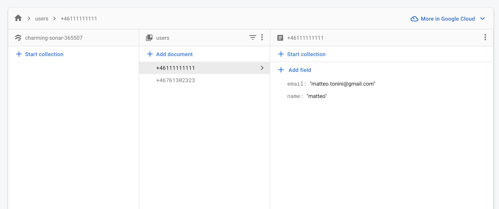

# NC-test

## Frontend

### Local setup

```
cd frontend
mv .example.env .env.development
yarn install
yarn start
```

Visit app at [http://localhost:3000](http://localhost:3000)

## Backend

### Local setup

```
cd backend
npm install
npm prepare
npm start
```

Backed exposed at [http://localhost:8080](http://localhost:8080)

## Live demo

Frontend: [https://nc-test.netlify.app](https://nc-test.netlify.app)  
Backend: [https://charming-sonar-365507.ey.r.appspot.com](https://charming-sonar-365507.ey.r.appspot.com)

### Test phone

- +46 11 111 11 11
- code: 111111

## DB Screenshot


